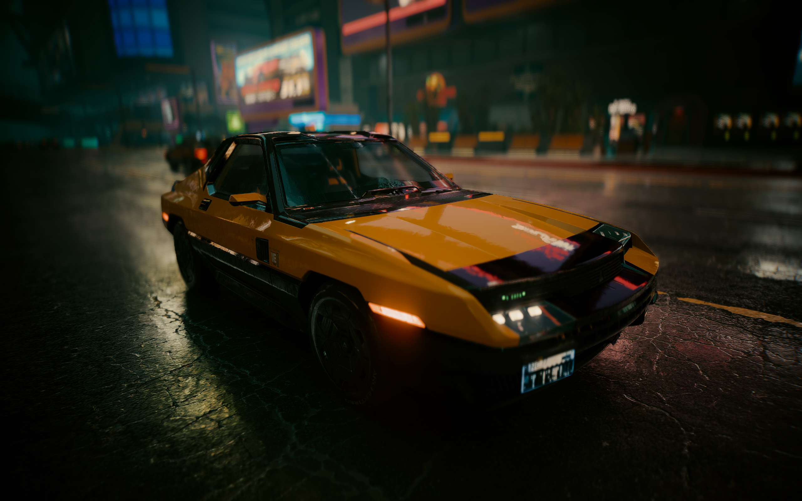
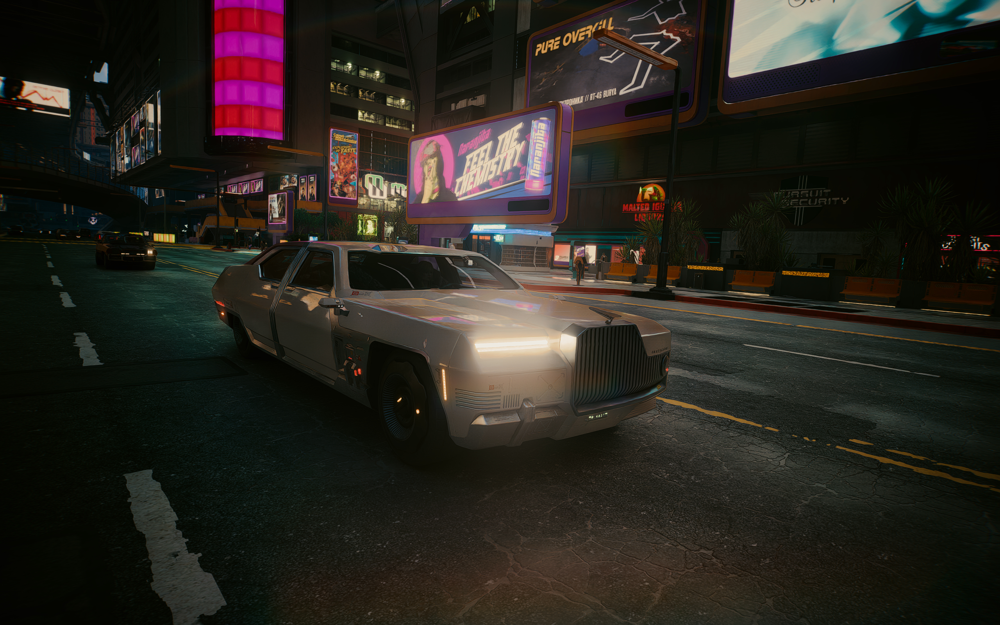
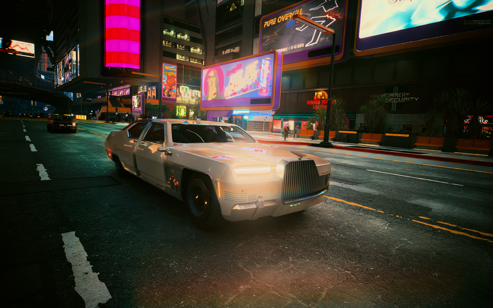

# Cyberpunk 2077 Native Photo Mode Ultra HDR v0.1

> Experimental first release. Read the compatibility and display disclaimer first.

[简体中文](README.zh-CN.md) | English

## Final v0.1 validation sample

[](public-media/v0.1-faithful-final-validation.UltraHDR.jpg)

This is the original 2560x1600 Ultra HDR JPEG from the second capture of the
exact v0.1 owner validation run. Click the image to download the original file.

## User-approved preset comparison

| Faithful | Rich |
| --- | --- |
|  |  |

Both files came from one native Photo Mode shutter and remain downloadable as
the original 2560x1600 Ultra HDR JPEGs. GitHub or a non-HDR viewer may display
only their SDR fallback.

## How this differs from screenshot tools

This is not a Steam, NVIDIA App, Xbox Game Bar, desktop, or swap-chain screenshot.
It observes Cyberpunk 2077's own Photo Mode shutter, keeps the game's native
blackout/notification/PNG path intact, and reads the current-resolution,
UI-free FP16 image from the game's internal Photo Mode `A852 -> 341` branch.
A CPU worker then encodes that image as an Ultra HDR JPEG.

RED4ext is the only runtime requirement. ReShade, Codeware, REDscript, and
external screenshot utilities are not required.

This is not a live-display HDR/tone-mapping mod either. It does not change the
gameplay image sent to the monitor; it repairs file output after the native
Photo Mode shutter. Both categories can coexist as separate concerns.

## Compatibility and display disclaimer

- v0.1 has been tested on one machine only: Cyberpunk 2077 Steam 2.31,
  RTX 5070 Laptop 8GB and HDR10 PQ. On that same machine, basic tests at
  multiple game resolutions, with ray tracing disabled, and at several RT
  quality levels all produced normal output. This does not establish support
  for other GPUs, drivers, Windows versions, mods, path-tracing combinations,
  or future game versions. Unknown bugs remain and no compatibility guarantee
  is made for this experimental build.
- Neither preset is a pixel-exact reproduction of the monitor output.
  `Faithful` only means it looked closer to the in-game reference on the tested
  PC and phone. `Rich` is intentionally brighter, warmer, and more saturated.
- The same file can look different depending on in-game paper white/peak,
  display capability, Windows HDR settings, viewer tone mapping, and gain-map
  support. Differences in brightness, color, blacks, and highlight boost across
  devices and apps are expected.
- Only HDR10 PQ has been validated. scRGB, HDR10+ dynamic metadata, and unknown
  HDR output modes are not claimed as supported.
- Photo Mode stickers and frames are composited after the current HDR capture
  point and are absent from v0.1 Ultra HDR files. The public package therefore
  defaults to `gallery=off`.

## Install and use

1. Install a RED4ext version compatible with game 2.31.
2. Close the game and launcher.
3. Extract the ZIP into the Cyberpunk 2077 game directory. You should have:

```text
Cyberpunk 2077\red4ext\plugins\CyberpunkPhotoModeHDR\
  CyberpunkPhotoModeHDR.dll
  CyberpunkPhotoModeHDRWorker.exe
  CyberpunkPhotoModeHDR.ini
```

4. Use HDR10 PQ, enter the game's native Photo Mode, and press its native shutter.
5. After the native save finishes, remain in Photo Mode briefly so the next frame
   can be submitted. Waiting is based on the actual render time, not a fixed delay.

Outputs are written to `%USERPROFILE%\Pictures\Cyberpunk 2077` as
`*_HDR_忠实.UltraHDR.jpg` and/or `*_HDR_浓郁.UltraHDR.jpg`. Ultra HDR viewers use
the gain map; ordinary JPEG viewers show the embedded SDR fallback.

That graceful fallback is the main reason for choosing Ultra HDR JPEG: an
HDR-aware viewer gains HDR while an unaware viewer can still open an ordinary
JPEG image. It is not a lossless master, recompression can remove the gain map,
and viewer tone mapping still varies. JXR, AVIF, PNG, EXR, and display screenshots
all have legitimate strengths; see `docs/FORMAT-CHOICE.md` for the objective matrix.

## Configuration

Edit `CyberpunkPhotoModeHDR.ini`:

```ini
[Output]
mode=faithful
gallery=off
```

- `mode=faithful|rich|both`
- `gallery=off|faithful|rich`

Gallery replacement is experimental. When enabled, the original PNG is backed
up byte-for-byte under
`Pictures\Cyberpunk 2077\.CyberpunkPhotoModeHDR\OriginalNativePNG`.
Because stickers/frames are not yet carried into the proxy, keep it off when
using those decorations.

## Uninstall and bug reports

Close the game and remove only
`red4ext\plugins\CyberpunkPhotoModeHDR`. Existing photos and backups remain.

For bug reports include the game version, GPU, driver, resolution, HDR mode,
rendering mode, `red4ext\logs\cyberpunkphotomodehdr-*.log`, the worker log, and
the crash ReportQueue path when applicable.

See `THIRD-PARTY-NOTICES.txt` and `licenses\` for third-party licenses.

## Optional support

If this project is useful to you, optional support is available through
[Ko-fi (global)](https://ko-fi.com/nofjmt) or
[Afdian (for users in China)](https://afdian.com/a/nofjmt). Donations do not
affect downloads, features, or bug-report handling.

## Limited source and license

This is not an MIT project and is not Open Source under the OSI definition.
Original project materials are offered source-available under the PolyForm
Noncommercial License 1.0.0; `LICENSE.md` controls. The public repository only
contains a limited audit surface for the native Photo Mode integration. The
complete game-version adapter, resource discovery, readback, color, and encoder
implementation is withheld. See `SOURCE-AVAILABLE-NOTICE.md`.

## Near-term improvements

The project will continue validation and incremental fixes without advertising
unproven features. Current areas include broader hardware/render-mode testing,
stickers and frames, Gallery refresh robustness, clearer diagnostics, and
reducing avoidable latency without weakening the temporal gate. No dates or
compatibility outcomes are promised.

